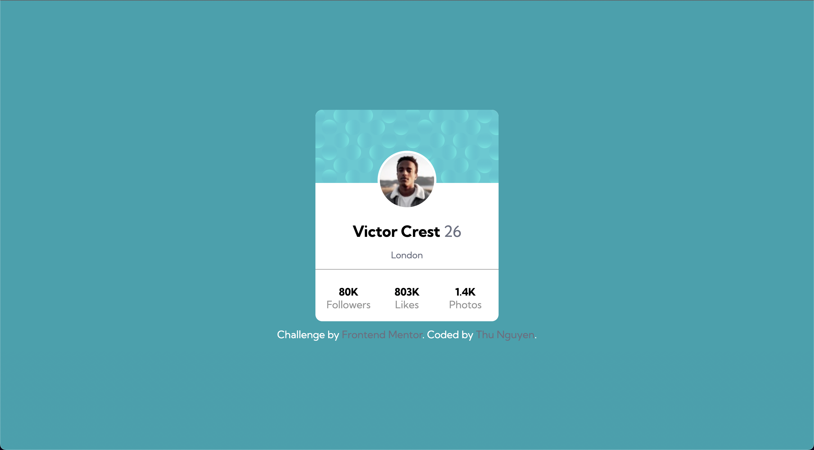

# Frontend Mentor - Profile card component solution

This is a solution to the [Profile card component challenge on Frontend Mentor](https://www.frontendmentor.io/challenges/profile-card-component-cfArpWshJ). Frontend Mentor challenges help you improve your coding skills by building realistic projects. 

## Table of contents

- [Overview](#overview)
  - [The challenge](#the-challenge)
  - [Screenshot](#screenshot)
- [Built with](#built-with)
- [What I learned](#what-i-learned)
- [Author](#author)
- [Feedbacks](#feedbacks)

## Overview

### The challenge

- Build out the project to the designs provided

### Screenshot

## Built with

- HTML5 
- CSS 
- Flexbox
- CSS Grid

## What I learned

I learned that beside using position relative and absolute to make items overflow, I can also use grid to do do.

Also, the repeat(3, 1fr) for grid layout does not mean that it will divide the container into 3 equal parts, it really depends on the item in each part.

## Author

- Website - [Thu Nguyen](https://github.com/NgocMinhThuNguyen)
- Frontend Mentor - [@NgocMinhThuNguyen](https://www.frontendmentor.io/profile/NgocMinhThuNguyen)

## Feedbacks

Hi there!

I'd be happy if you can give some feedback on my work!

Have a nice day!

Thank you!
